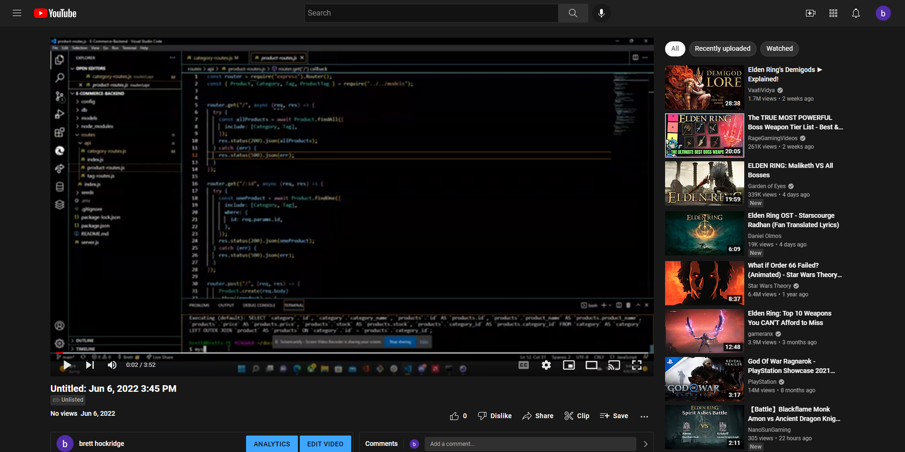

# E-Commerce-Backend

 

  
 

## Description:

A back end for an e-commerce site. Configure a working Express.js API to use Sequelize to interact with a MySQL database.

 
 

## Table of contents:

  * [License](#license)
  * [Video](#video)
  * [Installation](#installation)
  * [Contributions](#contributions)
  * [Tests](#tests)
  * [Credits](#credits)
  * [Author](#author)
  * [GitHub](#github)
  * [Questions](#questions)

 
 
  
## License:
 
      -  MIT License - Copyright (c) 2022 Brett Hockridge

 
 

## Video:

  
  
  
 

## Installation:
 
      -  Clone the files from my github repository provided below

 
 
  
  
## Contributions:
 
Reach me at my email provided below to be added as a contributor.

 
 
  
## Tests: 
 
npm install express, sequelize, mysql2, nodemon and dotenv. Once they're installed, initiate the database by logging into your mysql account and sourcing the schema.sql. Then in terminal link your seeds by node seeds/index.js and run the server by node server.js. Then open the application in Insomnia. 
  
 
 

## Credits:
 
Thank you to BCS for helping me get this working in Insomnia.

 
 

## Author:
 
Brett Hockridge
  
 
 

## Github:
 

[GitHub](https://github.com/BroBrett/E-Commerce-Backend)

## Questions:
  For any questions regarding this application, you may reach me directly at brettstephenhockridge@yahoo.com.

  To view my other applications, please check out my github page [BroBrett](https://github.com/BroBrett).